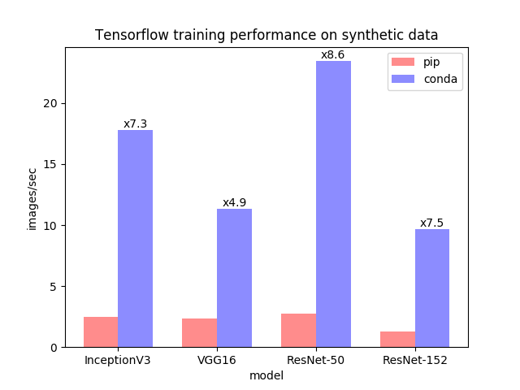

# Python Data Analysis wth Jupyter Notebook, Pandas, Numpy, Matplotlib and Seaborn

Treehouse Live with Jonathan Barrios: Python Data Analysis with Jupyter Notebook, Pandas, Numpy, Matplotlib, and Seaborn from the very beginning 🌐 Watch the [archived Livestream](https://join.teamtreehouse.com/treehouse-live/) 🍿

### Who is this Livestream for?
- Business and data analysts with a basic understanding of Python basics
- Excell experts, aspriting Data Scientist and Statistician who already use Jupyter Notebooks

If you're a complete beginner, welecome to the lucrative and super interesting field of data sciences. I suggest that complete beginners learn Python basics from Treehouse's 7-day free trial [here](https://teamtreehouse.com/subscribe/). Let's get started!

# Virtual environments for Data Science
Before we start jumping into data science, we need to tak about setting up a development environment. You could just start installing each python data science library using pip-- Pip is a recursive acronym that can stand for either "Pip Installs Packages" or "Pip Installs Python". Alternatively, pip stands for "preferred installer program". At the end of the day it's the de facto standard package-management system used to install and manage software packages written in Python. There are many other reasons such as faster performance, but that's outside of the scope of this livestream. See the chart and attribution link below for more.

<p align="center">
<br>
<br><br>
<em>Image from: https://www.anaconda.com/tensorflow-in-anaconda/</em><br><br>
</p>


### So why not use pip and be done with it?

Great question and here's why: pip does not have data science libraries pre-installed while other package managers, such as Anaconda, do. Another reason is collaboration-- sharing the exact packages and versions can be tedious when you have one environment containing all of your libraries on one machine. Pip does have a virtual environment called `virtualenv` which has been replaced by `pipenv`, but they also don't contain the data science libraries that Anaconda has pre-installed. If you guessed that we're going to use Anaconda, you're right and their virtual env is aptly named `conda`. Let's Begin!

`virtualenv` Vs `pipenv` Vs `anaconda` Vs `pyenv`
- pip 
    - virtualenv (older)
    - pipenv (newer)
- anaconda 📊(reccomended)
    - comes preinstalled with data science libraries
    - conda create --name my_project_name
    - conda env list

- pyenv
    - Manages both pipenv and anaconda
    - Allows switching between python versions and more

### Prerequisites
Install Anaconda(graphical) and `cd` into your project directory then set-up the virtual environment:
```python
conda create --name python_data_analysis pandas matplotlib seaborn #you could add django
```
then activate it like this:
```python
conda activate pyhton_data_analysis
conda deactivate #when you want to power it down
```
and finally, let's see what we have:
```python
conda env list #list all venvs
conda env export > environment.yml #share this env
# then
conda env create -f environment.yml #spawn this env
```
# Jupyter Notebook Kernel
Before we can start using our virtual env, it's important to note that we can open up Jupyter notebook from our new conda virtual environment, however; it's not using the same kernel and we want to use the same kernel. **Dilema:** If you open Jupyter Notebook you won't see our new env kernel as an option to create a new notebook. 😿

Try it out by starting Jupyter Notebook with the following command:
```python
jupyter notebook
```
### Solution:
To get the correct kernel to display as an option in Jupyter note books, install `ipykernel` inside of the active `python_data_analysis` env session. Our active session shows up as `(python_data_analysis)` in the terminal. Once you verify that you are in the correct direstory using an active session, use this command:
```python
pip install ipykernel
```

Next, install `ipykernel` to the conda env, like this:
```pyhton
python -m ipykernel install --user --name python_data_analysis --display-name "python_data_analysis"
```

Let's test out our new kernel by using this command in Jupyter Notebook:
```python
conda env list
```
If you get a message like this:
```python
# conda environments:
#
base                     /Users/username/opt/anaconda3
python_data_analysis  *  /Users/username/opt/anaconda3/envs/python_data_analysis


Note: you may need to restart the kernel to use updated packages.
```

You're good to go! Let's get started!
